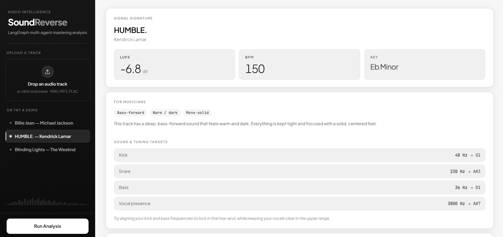
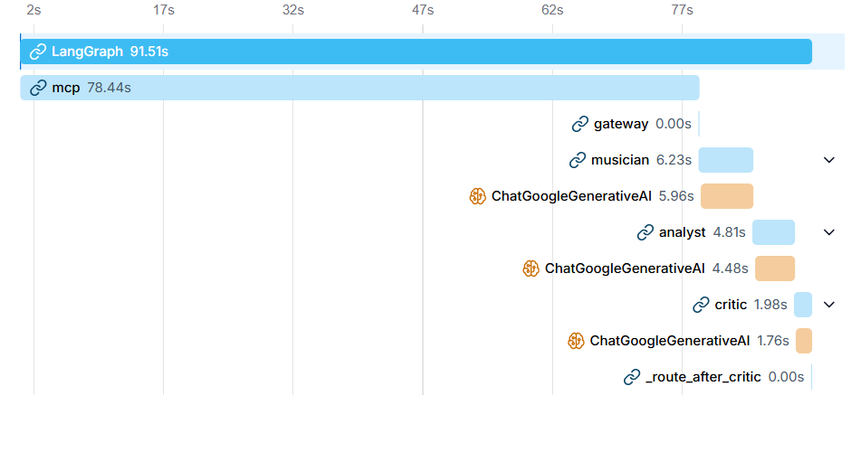
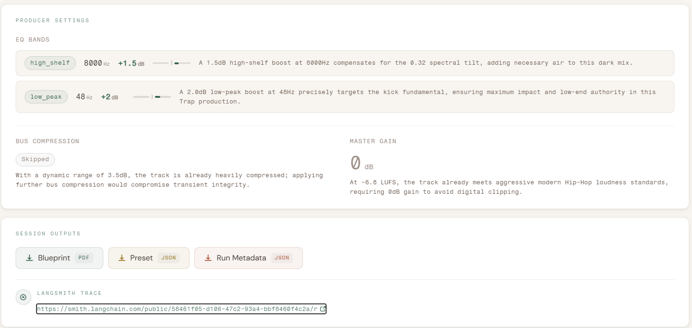

# SoundReverse

**A production LangGraph multi-agent system that reverse-engineers mastering decisions from an audio file's sonic fingerprint — producing EQ settings, compression parameters, musician notes, and a full agent reasoning trace as a downloadable Producer Session Pack.**

**[Live Demo →](https://soundreverse.vercel.app)** · **[LangSmith Trace (public) →](https://smith.langchain.com/public/58461f05-d106-47c2-93a4-bbf8460f4c2a/r)**

---

## Dashboard



*HUMBLE. by Kendrick Lamar — Signal Signature (−6.8 LUFS · 150 BPM · Eb Minor), Musician tonal tags (Bass-forward · Warm/dark · Mono-solid), and per-stem tuning targets (Kick 48 Hz ≈ G1, Bass 36 Hz ≈ D1) derived deterministically from the MCP output.*

---

## What Makes This Interesting

This isn't a chatbot wrapper. It's a constrained agentic pipeline where:

- **Audio analysis runs in a Modal-hosted MCP server** (HTDemucs 4-stem + CLAP) — the main app has zero audio libraries
- **All numbers come from a YAML rules engine evaluated in pure Python** — the LLM cannot hallucinate EQ frequencies or compression ratios
- **The Critic runs deterministic validation checks** — pass/fail logic is Python `if/else`, not vibes-based LLM judgment
- **A Musician agent bridges signal metrics to plain language** — derives tuning targets from stem fundamentals and writes plain-language notes for non-technical musicians
- **Every run produces a public LangSmith trace** — the full agent debate (including rejection/self-correction cycles) is observable and shareable
- **Fully async production API** — Supabase-backed job queue handles 70–95s pipelines without HTTP timeouts

---

## Architecture

```
┌─────────────────────────────────────────────────────────────────┐
│                        CLIENT (React/Vite)                       │
│  Upload mp3/wav  ──or──  Select demo track                       │
│  POST /analyze (multipart)  ──or──  POST /demo {track_id}        │
│  polls GET /jobs/{id} every 3s until completed                   │
└───────────────────────┬─────────────────────────────────────────┘
                        │ 202 Accepted → job_id
                        ▼
┌─────────────────────────────────────────────────────────────────┐
│                    FastAPI (Render)                               │
│  Supabase jobs table  ·  async background worker                 │
│  orphan reaper on startup  ·  output sweeper in production       │
└───────────────────────┬─────────────────────────────────────────┘
                        │
                        ▼
┌─────────────────────────────────────────────────────────────────┐
│                  LangGraph StateGraph                             │
│                                                                  │
│   ┌─────┐    ┌─────────┐    ┌──────────┐    ┌────────┐         │
│   │ MCP │───▶│ Gateway │───▶│ Musician │───▶│Analyst │         │
│   └─────┘    └─────────┘    └──────────┘    └───┬────┘         │
│      │        validates       stem Hz →          │              │
│      │        Pydantic        TuningTargets +     │              │
│      │        schema          tonal tags          ▼              │
│      │                                       ┌────────┐         │
│      │        upload → Modal MCP             │ Critic │         │
│      │        demo   → cache/*.json          └───┬────┘         │
│      │                                           │ confidence   │
│      │                                           │ < 0.8?       │
│      │                                           │ (max 3x)     │
│      │                              ┌────────────┘              │
│      │                              │ approved                  │
│      │                              ▼                           │
│      │                       ┌─────────────┐                   │
│      │                       │ output_node │  (outside graph)  │
│      │                       │ PDF + JSON  │                   │
│      │                       │ + trace URL │                   │
│      │                       └─────────────┘                   │
└──────┼──────────────────────────────────────────────────────────┘
       │
       ▼  (upload path only)
┌─────────────────────────────────────────────────────────────────┐
│              Modal MCP Server (external)                          │
│   POST /upload  →  job id                                        │
│   GET  /jobs/{id}  polls until SignalSignature ready             │
│   HTDemucs 4-stem  ·  CLAP embeddings  ·  FFmpeg                 │
│   returns: per-stem LUFS, spectral tilt, kick Hz, BPM, key …    │
└─────────────────────────────────────────────────────────────────┘
```

---

## Agent Pipeline

### 1 · MCP Node — entry point

Two branches, same output contract (`SignalSignature` JSON):

| Input | What happens |
|---|---|
| **Upload** (mp3/wav) | Streams file to Modal MCP (`POST /upload`), polls `/jobs/{id}` with tenacity retries until `SignalSignature` is ready (~30–90s) |
| **Demo track** | Loads pre-computed `cache/{track_id}.json` instantly — no network, no Modal cold start |

The Gateway contract (`raw_mcp_output → SignalSignature`) is the swap point — both branches must satisfy the same Pydantic schema.

### 2 · Gateway — schema validation (no LLM)

Pure Python. Validates `raw_mcp_output` against `SignalSignature` via `model_validate()`. On failure, sets `error + final` and routes directly to output.

### 3 · Musician — signal → plain language (hybrid)

Deterministic half:
- Extracts per-stem fundamental Hz from the `SignalSignature`
- Maps each to the nearest musical note (e.g. kick at 62 Hz → **B1**)
- Derives `tonal_tags` from master energy ratios / spectral tilt / stereo metrics

Generative half (structured tool call):
- Writes a friendly `tuning_tip` and `tonal_character` sentence grounded in the deterministic facts
- **Cannot invent numbers** — the tool schema only accepts string fields

Degradation: if the LLM call fails, falls back to deterministic strings and **never fails the run**.

### 4 · Analyst — rules engine + reason writer

```python
# Pure Python — LLM never touches these
eq_bands    = _apply_rules(signal_signature, rules_yaml)
compression = _apply_compression_rule(signal_signature, rules_yaml)
master_gain = _apply_gain_rule(signal_signature, rules_yaml)

# Structured tool call — LLM only writes human-readable reason strings
reasons = _refine_reasons(draft_settings, signal_signature, prior_critique)
```

`rules.yaml` maps raw metrics to settings deterministically:

```yaml
- id: kick_fundamental_boost
  condition: "stems.drums.kick_fundamental_hz is not null"
  action:
    eq_band: { band: "low_peak", freq: "{kick_fundamental_hz}", gain_db: +2.0, q: 1.2 }
  reason_template: "kick fundamental at {value}Hz"

- id: spectral_tilt_bright
  condition: "master.spectral_tilt > 0.7"
  action:
    eq_band: { band: "high_shelf", freq: 10000, gain_db: -2.5 }
  reason_template: "spectral_tilt={value} — bright mix, high shelf cut"
```

### 5 · Critic — deterministic checks + generative feedback

Four physical-impossibility checks (pure Python):

| Check | Condition |
|---|---|
| Over-compression | `compression.ratio != null AND master.dynamic_range_db < 4` |
| Bright boost contradiction | `any EQ high-shelf gain_db > 0 AND master.spectral_tilt > 0.75` |
| Loudness ceiling | `master_gain_db > 0 AND master.lufs > -9` |
| Kick frequency drift | `boost freq differs from stems.drums.kick_fundamental_hz by > 20 Hz` |

If `confidence ≥ 0.8` **or** `iteration_count ≥ 3` → approve and proceed to output.
If `confidence < 0.8` → LLM writes targeted correction hints → loops back to Analyst.

**Stress test:** HUMBLE. deliberately overshoots kick frequency by +30 Hz on iteration 1 to exercise the rejection/self-correction cycle.

### 6 · Output Node — runs outside the graph

The LangSmith trace URL is only available *after* `app.invoke()` completes. Running the output generator post-invocation means the PDF and JSON preset both embed the real, shareable trace URL.

Produces three files per run (prefixed by `job_id`):
- `{job_id}_blueprint.pdf` — 2-page producer brief (musician-first page 1, reference metrics page 2)
- `{job_id}_preset.json` — raw `ProducerSettings` + trace URL
- `{job_id}_metadata.json` — full pipeline log including `critic_rounds`

---

## The MCP Server

The audio analysis runs in a **separate Modal-deployed MCP server** — not in this repo.

```
POST /upload    multipart file → returns { job_id }
GET  /jobs/{id} polls → returns SignalSignature JSON when ready
```

`SignalSignature` carries per-stem and master metrics extracted by:
- **HTDemucs 4-stem** — separates drums / bass / vocals / other
- **FFmpeg + Librosa** — LUFS, peak dB, dynamic range, spectral tilt, stereo correlation
- **CLAP** — BPM confidence, key detection
- **Per-stem fundamentals** — kick Hz, snare Hz, bass fundamental, vocal presence peak

The main app has **no audio libraries** — Demucs/Librosa/Essentia never run here.

---

## Key Design Decisions

**Rules own the numbers, LLM owns the words.**
All EQ frequencies, compression ratios, and gain values come from `rules.yaml` evaluated in Python. The LLM only writes the `reason` strings. This prevents hallucinated settings while keeping the output human-readable.

**Critic is deterministic on pass/fail, generative on narrative.**
The 4 validation checks are pure Python `if/else`. The LLM writes the critique and correction hints — making feedback actionable without letting the model decide what's physically valid.

**Structured tool calls, never free-text parsing.**
Both the Analyst and Critic use LangChain tool-call schemas (`ReasonBundle`, `CritiqueBundle`). The model cannot return anything outside the schema — no string parsing, no regex extraction.

**Musician agent degrades gracefully.**
If the LLM call fails mid-pipeline, the Musician falls back to deterministic text and passes state through untouched. The run continues and the user gets output — just without the LLM-phrased notes.

**Output node runs outside the graph.**
LangSmith's `client.share_run()` only resolves after `app.invoke()` returns. Keeping the output generator outside the graph means the PDF embeds the real trace URL, not a placeholder.

**Async API with Supabase job queue.**
The full pipeline (Modal cold start + 4 Gemini calls) takes 70–95s — well beyond an HTTP request window. `POST /analyze` enqueues a job and returns `202 + job_id` immediately. The frontend polls `GET /jobs/{id}` every 3s. Supabase stores job state persistently across restarts.

---

## LangSmith Trace

Every run produces a **public, shareable trace** — no login required.



*Single-pass run — 91.5s total: 78.4s Modal MCP (upload + stem analysis), then gateway (0s) → musician (6.2s) → analyst (4.8s) → critic (2.0s) → approved. 3 Gemini calls, all structured tool calls.*

Live trace: [smith.langchain.com/public/58461f05-d106-47c2-93a4-bbf8460f4c2a/r](https://smith.langchain.com/public/58461f05-d106-47c2-93a4-bbf8460f4c2a/r)

---

## Producer Settings Output



---

## Tech Stack

| Layer | Technology |
|---|---|
| Agent orchestration | LangGraph `StateGraph` — conditional edges, typed `GraphState` |
| LLM | `gemini-3.1-flash-lite` via `langchain-google-genai` — structured tool calling |
| Audio analysis | HTDemucs 4-stem, FFmpeg, Librosa — **Modal-hosted MCP server** |
| MCP client | `requests` + `tenacity` — streams file, polls job, deserialises `SignalSignature` |
| Schema validation | Pydantic v2 |
| Rules engine | PyYAML — deterministic EQ/compression mapping evaluated in pure Python |
| Observability | LangSmith — public trace URLs, full agent debate log |
| Async job queue | FastAPI + Supabase (`jobs` table) — 300s worker, orphan reaper, output sweeper |
| Frontend | React + Vite + Tailwind CSS v4 |
| PDF output | fpdf2 — 2-page blueprint |
| Backend deploy | Render (Python native runtime) |
| Frontend deploy | Vercel |

---

## Project Structure

```
soundreverse/
├── agents/
│   ├── mcp.py          # Entry node: upload → Modal MCP; demo → cache/*.json
│   ├── gateway.py      # Pydantic schema validation — no LLM
│   ├── musician.py     # Stem Hz → TuningTargets + tonal tags; LLM phrases notes
│   ├── analyst.py      # rules.yaml eval (Python) + Gemini reason writing
│   ├── critic.py       # 4 deterministic checks + Gemini critique/hints
│   └── graph.py        # LangGraph StateGraph, conditional edges, run()
├── schemas/
│   ├── signal_signature.py  # Pydantic — matches Modal MCP output exactly
│   ├── track_request.py
│   ├── producer_settings.py
│   └── musician_notes.py
├── rules/
│   └── rules.yaml      # Deterministic EQ / compression / gain mapping
├── cache/              # 3 pre-computed SignalSignature JSON files (demo tracks)
├── output/
│   └── generator.py    # PDF blueprint + JSON preset + metadata writer
├── frontend/           # React + Vite dashboard
├── api.py              # FastAPI — async job queue, Supabase state, file upload
├── utils/
│   └── supabase_client.py
├── tests/              # pytest — analyst rules, critic, gateway, mcp contract, api
└── runtime.txt         # Pins Python 3.11 for Render
```

---

## Setup

```bash
# 1. Clone and install
git clone https://github.com/ripunjay-kashyap/soundreverse.git
cd soundreverse
python -m venv venv && venv/Scripts/activate   # Windows
pip install -r requirements.txt

# 2. Environment variables
cp .env.example .env
# Fill in: GOOGLE_API_KEY, LANGSMITH_API_KEY, SUPABASE_URL, SUPABASE_ANON_KEY
# Optional: SONIC_MCP_URL (only needed for real file upload, not demo tracks)

# 3. Run backend
venv/Scripts/python -m uvicorn api:app --reload --port 8001

# 4. Run frontend (separate terminal)
cd frontend && npm install && npm run dev

# 5. Open http://localhost:5173
# Demo tracks work immediately — upload path needs SONIC_MCP_URL
```

**CLI (demo tracks, no server needed):**
```bash
python -m agents.graph --demo humble_kendrick
```

**Tests:**
```bash
pytest tests/ -v
```

---

## Demo Tracks

| Track | Artist | Notes |
|---|---|---|
| Billie Jean | Michael Jackson | Pop/funk — mid-forward, tight dynamics |
| HUMBLE. | Kendrick Lamar | ⚡ Triggers 2-iteration critic loop (stress test) |
| Blinding Lights | The Weeknd | Synth-pop — loud master, bright spectral tilt |

⚡ HUMBLE. deliberately overshoots kick EQ frequency by +30 Hz on iteration 1 to demonstrate the Analyst–Critic rejection and self-correction cycle end-to-end.
